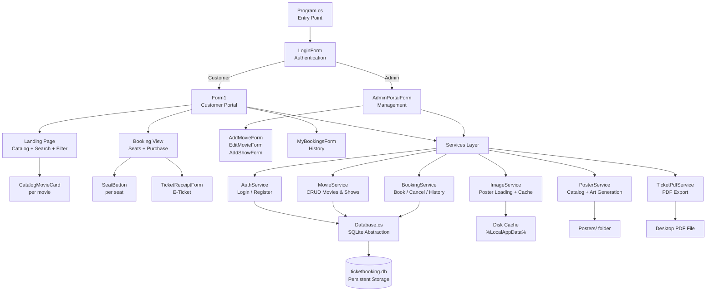

# CineTicket — Project File Documentation

> **Project:** CineTicket Movie Ticket Booking System
> **Framework:** .NET Framework 4.7.2 | Windows Forms
> **Database:** SQLite (via Microsoft.Data.Sqlite)
> **Target:** Desktop (Windows)

---

## 📁 Project Structure Overview

```
TicketBooking/
├── Program.cs               ← App entry point & routing loop
├── ProgramState.cs          ← Global session state (logged-in user)
├── TicketBooking.csproj     ← Project configuration & NuGet packages
│
├── Data/
│   └── Database.cs          ← SQLite setup, schema, migrations & seeding
│
├── Models/
│   ├── Auth.cs              ← User, LoginRequest, RegisterRequest, AuthResult
│   ├── Movie.cs             ← Movie data model
│   ├── Show.cs              ← Showtime data model
│   ├── Seat.cs              ← Individual cinema seat model
│   └── Booking.cs           ← Booking record & analytics models
│
├── Services/
│   ├── AuthService.cs       ← Login, registration, password hashing
│   ├── MovieService.cs      ← CRUD for movies & shows
│   ├── BookingService.cs    ← Seat booking, cancellation, booking history
│   ├── ImageService.cs      ← Poster image loader with memory + disk cache
│   ├── PosterService.cs     ← Movie catalog definitions & fallback poster art
│   └── TicketPdfService.cs  ← E-ticket PDF generation & save to desktop
│
├── Controls/
│   ├── Form1.cs             ← Customer portal (catalog, landing page, booking)
│   ├── Form1.Designer.cs    ← Auto-generated WinForms layout code for Form1
│   ├── AdminPortalForm.cs   ← Admin portal (movie management, analytics)
│   ├── AddMovieForm.cs      ← Dialog: add a new movie
│   ├── EditMovieForm.cs     ← Dialog: edit an existing movie
│   ├── AddShowForm.cs       ← Dialog: add a showtime to a movie
│   ├── LoginForm.cs         ← Login dialog (phone + password)
│   ├── RegisterForm.cs      ← New user registration dialog
│   ├── MyBookingsForm.cs    ← Customer booking history list
│   ├── TicketReceiptForm.cs ← E-ticket receipt viewer & PDF export
│   ├── UserProfileForm.cs   ← Customer profile viewer / sign-out
│   ├── CatalogMovieCard.cs  ← Movie card widget for the catalog grid
│   ├── MovieCard.cs         ← Legacy movie list item (booking view left panel)
│   ├── SeatButton.cs        ← Clickable seat button in the seating map
│   └── GraphicsExtensions.cs← GDI+ helpers (rounded rects, double buffering)
│
└── Properties/
    ├── AssemblyInfo.cs      ← Assembly metadata (version, company, copyright)
    ├── Resources.Designer.cs← Auto-generated resource accessor
    └── Settings.Designer.cs ← Auto-generated app settings
```

---

## 🚀 Entry Point

### `Program.cs`
**Role:** Application bootstrap and main routing loop.

- Enables Windows visual styles for modern control rendering.
- Calls `Database.EnsureCreated()` to initialize the SQLite schema on first run.
- Seeds two default accounts at startup:
  - **Admin** — Phone: `085909135`, Password: `168168`
  - **Demo Customer** — Phone: `098765432`, Password: `123456`
- Runs an infinite routing loop:
  - If not logged in → shows `LoginForm`.
  - Logged-in **Admin** → opens `AdminPortalForm`.
  - Logged-in **Customer** → opens `Form1` (Customer Portal).
  - If the user closes the window without logging out, the loop exits and the app terminates.

---

## 🌐 Global Session State

### `ProgramState.cs`
**Role:** Static singleton that holds the currently logged-in user across all forms.

| Property | Description |
|---|---|
| `CurrentUser` | Full `User` object of the logged-in user |
| `CurrentUserId` | Shorthand — `CurrentUser.Id` |
| `CurrentUserPhone` | User's phone number |
| `CurrentUserFullName` | User's display name |
| `CurrentUserEmail` | User's email address |
| `CurrentUserIsAdmin` | `true` if the user has admin privileges |
| `IsLoggedIn` | `true` if a valid session exists |

**Methods:** `SetUser(user)` sets the session. `Logout()` clears it.

All forms read `ProgramState` to decide what controls to show (e.g., admin-only buttons).

---

## 🗄️ Database Layer

### `Data/Database.cs`
**Role:** All SQLite operations — schema creation, safe migrations, and data seeding.

**Key members:**

| Member | Description |
|---|---|
| `DbPath` | Resolves the `.db` file path. Uses the app directory by default, falls back to `%LocalAppData%\TicketBooking\` if read-only. |
| `GetConnection()` | Opens a SQLite connection with `PRAGMA foreign_keys = ON`. |
| `EnsureCreated()` | Creates tables `Users`, `Movies`, `Shows`, `Bookings` if they don't exist, plus performance indexes. |
| `RunSafeMigrations()` | Safely adds new columns to existing databases using `ALTER TABLE` (silently ignores "column exists" errors). |
| `SeedOrEnrichCatalog()` | Inserts or updates the full 16-movie catalog. Ensures each movie has at least 3 showtimes (Standard, Dolby Atmos, IMAX Laser). Pre-books sample seats for demo. |

**Database tables:**

| Table | Purpose |
|---|---|
| `Users` | Registered accounts (phone, name, email, bcrypt hash, admin flag) |
| `Movies` | Movie catalog (title, genre, duration, description, poster, price, rating, age rating, release date) |
| `Shows` | Scheduled screenings (movie FK, datetime, hall name, seat grid size) |
| `Bookings` | Ticket reservations (user FK, show FK, seat code, price, status, reference code) |

---

## 📦 Models

### `Models/Auth.cs`
**Role:** Authentication-related data structures.

| Type | Description |
|---|---|
| `UserRole` | Enum: `Customer = 0`, `Admin = 1` |
| `User` | Account record with `Id`, `Phone`, `FullName`, `Email`, `PasswordHash`, `IsAdmin`, `CreatedAt`. Computed `DisplayName` and `Role`. |
| `LoginRequest` | DTO carrying `Phone` and `Password` to `AuthService.Login()`. |
| `RegisterRequest` | DTO carrying all registration fields plus `ConfirmPassword`. |
| `AuthResult` | Login/register outcome. Has `Success`, `ErrorMessage`, `User`. Factory: `AuthResult.Ok(user)` / `AuthResult.Fail(msg)`. |

---

### `Models/Movie.cs`
**Role:** Represents one movie in the catalog.

| Property | Description |
|---|---|
| `Id` | Database primary key |
| `Title` | Movie title |
| `Genre` | Genre string (e.g., "Action / Adventure") |
| `Duration` | Runtime as `TimeSpan` |
| `PosterPath` | Local file path or HTTPS URL of the poster |
| `Description` | Full synopsis |
| `Price` | Ticket price |
| `Rating` | Rating string (e.g., "9.0/10") |
| `AgeRating` | Age classification (e.g., "PG-13") |
| `ReleaseDate` | Optional `DateTime?` |
| `Shows` | List of `Show` objects for this movie |

---

### `Models/Show.cs`
**Role:** Represents one scheduled screening.

| Property | Description |
|---|---|
| `Id` | Database primary key |
| `MovieId` | FK to Movies |
| `Time` | Showtime `DateTime` |
| `HallName` | Cinema hall (e.g., "Hall 3 (IMAX Laser)") |
| `TotalRows` / `TotalCols` | Seat grid dimensions (default 6×8) |
| `Seats` | List of `Seat` objects for the seating map |
| `BookedSeatsCount` | Computed booked count |
| `AvailableSeatsCount` | Computed remaining seats |
| `DisplayText` | e.g., "Mon, Oct 5 • 08:00 PM (Hall 1)" |

---

### `Models/Seat.cs`
**Role:** Represents one seat in a cinema hall.

| Property | Description |
|---|---|
| `Row` | Zero-based row index |
| `Number` | Zero-based column index |
| `IsBooked` | Already reserved by someone |
| `IsSelected` | Customer has clicked to choose this seat |
| `IsVip` | `true` if Row ≥ 4 (back rows) |
| `Label` | Seat code string, e.g., `"C4"` |

---

### `Models/Booking.cs`
**Role:** Represents a completed ticket booking.

Key fields: `UserId`, `ShowId`, `MovieTitle`, `HallName`, `ShowTime`, `SeatCode`, `Price`, `Status` (`"Confirmed"` / `"Cancelled"`), `ReferenceCode`.

Computed helpers:
- `IsActive` / `IsCancelled` — status flags
- `IsPast` — whether the show has already ended
- `ShowCountdown` — e.g., "Starts in 45 min!" or "Screening Finished"

Also contains `AdminAnalytics` — a summary DTO for the Admin dashboard: total revenue, tickets sold, active movies, customer count, cancelled bookings.

---

## ⚙️ Services

### `Services/AuthService.cs`
**Role:** All user authentication and account management logic.

| Method | Description |
|---|---|
| `Login(request)` | Looks up user by phone, verifies BCrypt hash, returns `AuthResult`. |
| `Register(request)` | Validates input, checks for duplicate phone, hashes password, inserts user. |
| `CreateUser(phone, pass, isAdmin, ...)` | Upsert a user — used at startup for default accounts. |
| `GetAllUsers()` | Returns all users (Admin Portal user list). |
| `UpdateUser(user, newPass)` | Updates profile fields and optionally rehashes password. |
| `DeleteUser(userId)` | Removes a user account. |

Uses **BCrypt.Net** for secure password hashing.

---

### `Services/MovieService.cs`
**Role:** Database CRUD for movies and showtimes.

| Method | Description |
|---|---|
| `GetMoviesWithShows()` | Loads all movies with their shows in 2 optimized queries. |
| `GetMovieById(id)` | Fetches one movie with its shows. |
| `AddMovie(movie)` | Inserts a new movie, returns new ID. |
| `UpdateMovie(movie)` | Updates all fields of an existing movie. |
| `DeleteMovie(id)` | Deletes a movie (cascades to shows and bookings). |
| `AddShow(show)` | Inserts a new showtime. |
| `DeleteShow(id)` | Deletes a showtime. |
| `GetShowWithSeats(showId)` | Loads a show and marks which seats are booked. |

---

### `Services/BookingService.cs`
**Role:** Seat reservation, cancellation, and booking retrieval.

| Method | Description |
|---|---|
| `BookSeats(userId, showId, seats, price, out error)` | Atomically books multiple seats in a transaction. Detects conflicts, generates a unique reference code. |
| `CancelBooking(bookingId, userId)` | Soft-deletes a booking by setting `Status = "Cancelled"`. |
| `GetUserBookings(userId)` | All bookings for a specific customer, with full movie/show/seat detail. |
| `GetAllBookings()` | All bookings system-wide (Admin Portal). |
| `GetAnalytics()` | Returns `AdminAnalytics` summary for the dashboard. |

---

### `Services/ImageService.cs`
**Role:** Poster image loader with two-level caching.

- **Memory cache** — `ConcurrentDictionary<string, Image>` prevents redundant re-loads.
- **Disk cache** — Internet-downloaded posters are saved to `%LocalAppData%\TicketBooking\Posters\` with MD5-hashed filenames.
- `LoadImage(pathOrUrl)` — Accepts a local path or HTTPS URL. Returns `System.Drawing.Image` or `null`.
- `LoadImageAsync(pathOrUrl, callback)` — Downloads in a background thread, invokes `callback` on the UI thread when ready.

---

### `Services/PosterService.cs`
**Role:** Defines the complete 16-movie catalog and generates fallback poster art.

- **`Catalog`** — Static list of `MovieTemplate` objects. Each entry has title, genre, duration, rating, age rating, release date, price, tagline, full description, poster filename, internet URL, and gradient colors.
- **`EnsureAllPostersGenerated()`** — For every movie whose poster `.jpg` is missing from the `Posters/` folder, procedurally generates a 400×600 gradient poster using GDI+ (title, tagline, genre badge, star rating, age badge, decorative emblem).

The catalog includes: *Dune: Part Two*, *Oppenheimer*, *Spider-Man: Across the Spider-Verse*, *The Lion King*, *Interstellar*, and 11 more.

---

### `Services/TicketPdfService.cs`
**Role:** Generates a premium printable e-ticket and exports it as a PDF.

| Method | Description |
|---|---|
| `GenerateTicketBitmap(booking)` | Renders a 1200×1600 px e-ticket with: cinema logo header, movie poster thumbnail, booking details table, reference code, and barcode strip. |
| `SaveAsPdf(booking, filePath)` | Saves the bitmap as a multi-page PDF using .NET `PrintDocument`. |
| `SaveTicketToDesktop(booking, out path)` | Saves the PDF to the user's Desktop and returns the file path. |
| `OpenTicketPreview(booking, parentForm)` | Renders the ticket preview inside `TicketReceiptForm`. |

---

## 🖥️ Forms & Controls

### `Controls/Form1.cs` + `Form1.Designer.cs`
**Role:** The main **Customer Portal** — primary screen for browsing movies and booking tickets.

**Two views in one form:**

**① Landing Page (Movie Catalog)**
- **Two-tier header:**
  - *Tier 1:* `CINETICKET` logo (left) · 🔍 Search pill (center-left) · Pill action buttons: Admin Portal, My Bookings, Profile, Sign Out (right). Gradient painted background.
  - *Tier 2:* Sub-nav text links — 🏠 Home, 🎬 Movies, 🔥 Trends, ⭐ Top Rated, 🕒 Now Showing — with active link in crimson red. Halls indicator on right. Separated from Tier 1 by a subtle divider.
- **Hero banner** — "🎬 NOW SHOWING IN THEATRES" with subtitle.
- **Filter bar** — Genre dropdown + Sort dropdown + live count label.
- **Catalog grid** — Scrollable `FlowLayoutPanel` of `CatalogMovieCard` widgets.

**② Booking View**
- Activated when clicking a movie card.
- Shows left panel (movie selector, showtime picker) and right panel (seating map, price, purchase button).
- Breadcrumb header + "⬅ Back to Movies" button.
- Admin-only: Edit Movie, Delete Movie, Add Showtime buttons.

`Form1.Designer.cs` holds the auto-generated panel/control initialization code.

---

### `Controls/AdminPortalForm.cs`
**Role:** The **Admin Portal** — cinema management interface for staff.

Four sections:
1. **Movie Management** — Table of all movies. Add, edit, delete movies and their showtimes.
2. **Booking Management** — All bookings across all customers, with detail view.
3. **Analytics Dashboard** — Revenue, tickets sold, active movies, customers, cancellations.
4. **User Management** — All accounts with add/delete capability.

---

### `Controls/AddMovieForm.cs`
**Role:** Modal dialog for adding a new movie.

Fields: Title, Genre, Duration, Description, Poster (path or URL), Price, Rating, Age Rating, Release Date. Calls `MovieService.AddMovie()` on submit.

---

### `Controls/EditMovieForm.cs`
**Role:** Modal dialog for editing an existing movie.

Pre-populates all fields from the selected `Movie`. Calls `MovieService.UpdateMovie()` on save.

---

### `Controls/AddShowForm.cs`
**Role:** Modal dialog for scheduling a new showtime.

Fields: Movie selector, Date/Time, Hall Name, Rows, Columns. Calls `MovieService.AddShow()` on submit.

---

### `Controls/LoginForm.cs`
**Role:** Login dialog shown at startup and after sign-out.

Fields: Phone number, Password (masked). Calls `AuthService.Login()`. On success, sets `ProgramState.SetUser()`. Contains link to `RegisterForm`.

---

### `Controls/RegisterForm.cs`
**Role:** New account registration dialog.

Fields: Full Name, Phone, Email, Password, Confirm Password. Validates all inputs and calls `AuthService.Register()`.

---

### `Controls/MyBookingsForm.cs`
**Role:** Customer booking history viewer.

Shows all bookings with: movie title, showtime, seat code, hall, price, status, reference code, and countdown timer. Buttons to view e-ticket or cancel a booking.

---

### `Controls/TicketReceiptForm.cs`
**Role:** E-ticket receipt viewer and PDF export.

Renders a full preview of the e-ticket using `TicketPdfService`. Has a **"Save PDF to Desktop"** button that exports and confirms the saved path.

---

### `Controls/UserProfileForm.cs`
**Role:** Customer profile viewer.

Displays name, phone, email, and account creation date. **Sign Out** button triggers logout and navigates back to the login screen.

---

### `Controls/CatalogMovieCard.cs`
**Role:** Reusable movie card widget for the catalog grid.

Each card shows: poster image (async-loaded), title, genre badge, rating, age rating, duration, showtime count, price, and a `🎟️ Book` button.

Raises `MovieBookClicked` event → `Form1` transitions to the booking view for that movie.

---

### `Controls/MovieCard.cs`
**Role:** Legacy compact movie list item for the booking view's left panel.

Displays title, genre, and runtime in a narrow format inside `flowMovies`. Clicking calls `Form1.SelectMovie()`.

---

### `Controls/SeatButton.cs`
**Role:** Individual clickable seat in the cinema seating map.

**States:**
- **Available** — dark grey, clickable
- **Selected** — teal highlight (customer chose this seat)
- **Booked** — dim muted colour, not clickable (already reserved)
- **VIP** — back-row seats (rows E–F) rendered with a gold accent

Raises `SeatClicked` event when toggled.

---

### `Controls/GraphicsExtensions.cs`
**Role:** Shared GDI+ helper and extension methods.

| Method | Description |
|---|---|
| `SetDoubleBuffered(control)` | Enables double-buffering via reflection to eliminate flicker on any `Control` |
| `FillRoundedRectangle(g, brush, rect, radius)` | Draws a filled rounded-corner rectangle |
| `DrawRoundedRectangle(g, pen, rect, radius)` | Draws a rounded-corner rectangle outline |

---

## 📄 Project Configuration

### `TicketBooking.csproj`
**Role:** MSBuild project file.

- Target framework: `.NET Framework 4.7.2`
- Output type: `WinExe` (Windows desktop GUI)
- NuGet dependencies:
  - `Microsoft.Data.Sqlite` — SQLite database driver
  - `BCrypt.Net-Next` — Secure password hashing

---

## 🗃️ Runtime Database File

### `bin/Debug/ticketbooking.db`
**Role:** The live SQLite database created and managed at runtime.

Contains all persistent data across the four tables: `Users`, `Movies`, `Shows`, `Bookings`. Created automatically on first launch. Delete it to reset all data back to seeded defaults.

---

## 🏗️ Architecture Overview



---

*CineTicket v1.0 · .NET Framework 4.7.2 · Windows Forms · SQLite*
